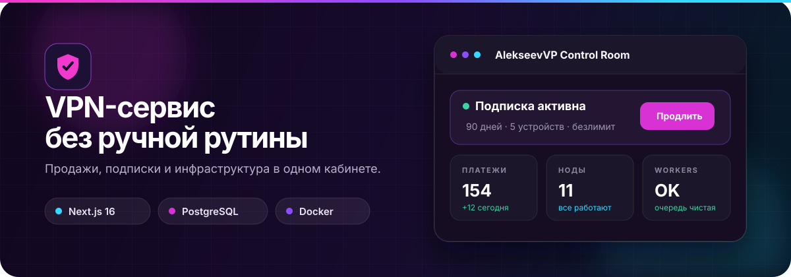
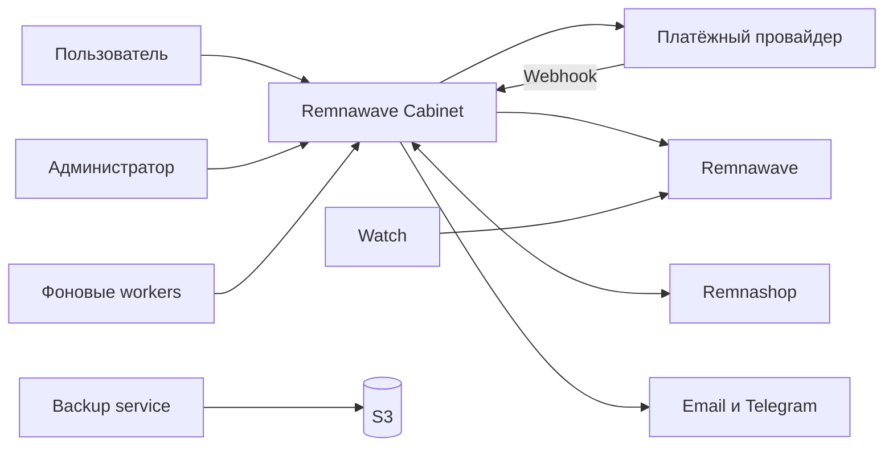

<p align="center">
  
</p>

<h1 align="center">Remnawave Cabinet</h1>

<p align="center">
  <strong>Готовый личный кабинет для VPN-сервиса на Remnawave</strong>
  <br />
  Продажи, подписки, поддержка и инфраструктура в одном понятном интерфейсе.
</p>

<p align="center">
  <a href="https://github.com/asdcrosh/cabinet_remna/actions/workflows/quality.yml"></a>
  <a href="https://github.com/asdcrosh/cabinet_remna/actions/workflows/docker-image.yml"></a>
  
  
  
</p>

<p align="center">
  <a href="#запуск-за-несколько-минут"><strong>Установить</strong></a>
  &nbsp;·&nbsp;
  <a href="#что-умеет-cabinet">Возможности</a>
  &nbsp;·&nbsp;
  <a href="./DEPLOYMENT.md">Развёртывание</a>
  &nbsp;·&nbsp;
  <a href="./deploy/RUNBOOK.md">Runbook</a>
  &nbsp;·&nbsp;
  <a href="./deploy/env.production.example">Конфигурация</a>
</p>

<p align="center">
  
</p>

## Не просто витрина с тарифами

Cabinet закрывает весь путь клиента: от первой регистрации до оплаты, подключения нового устройства и обращения в поддержку. Администратор управляет сервисом там же, без ручной сверки нескольких панелей и таблиц.

<table>
  <tr>
    <td width="33%" valign="top">
      <h3>Личный кабинет</h3>
      Покупка и продление тарифа, подключение через INCY, устройства, трафик, бонусы и поддержка.
    </td>
    <td width="33%" valign="top">
      <h3>Управление сервисом</h3>
      Пользователи, платежи, тарифы, промокоды, рассылки, рефералы и история действий.
    </td>
    <td width="33%" valign="top">
      <h3>Контроль инфраструктуры</h3>
      Состояние системы, Watch, workers, синхронизация, ноды, бэкапы и диагностика.
    </td>
  </tr>
</table>

```text
Регистрация  →  Оплата  →  Выдача подписки  →  Подключение в INCY  →  Продление
```

> [!NOTE]
> Cabinet дополняет Remnawave, а не заменяет его. Remnawave отвечает за VPN-подписки и ноды, Cabinet добавляет пользовательский интерфейс, платежи и бизнес-логику.

## Что получает пользователь

| Сценарий | Как это выглядит |
| --- | --- |
| **Начать пользоваться** | Регистрация по email, через Telegram Mini App или Яндекс ID |
| **Купить доступ** | Выбор периода, промокод, удобный способ оплаты и автоматическая выдача |
| **Подключить устройство** | Определение платформы, установка INCY и открытие подписки одной кнопкой |
| **Проверить VPN** | Проверка текущего подключения с отображением ноды и страны |
| **Управлять доступом** | Срок действия, трафик, активные устройства, смена приватной ссылки |
| **Получить помощь** | Поддержка вынесена в основное меню и доступна без поиска по настройкам |

Администратор видит тот же путь целиком: кто зарегистрировался, что оплатил, была ли выдана подписка и где возникла ошибка.

## Что умеет Cabinet

<table>
  <tr>
    <td width="50%" valign="top">
      <h3>Продажи и подписки</h3>
      <ul>
        <li>Тарифы с визуальной сортировкой</li>
        <li>Покупка и продление подписки</li>
        <li>Промокоды для покупки или продления</li>
        <li>Персональные предложения и кампании</li>
        <li>Возврат платежа с отзывом выданного доступа</li>
      </ul>
    </td>
    <td width="50%" valign="top">
      <h3>Платежи</h3>
      <ul>
        <li>YooKassa, PayAnyWay и Platega</li>
        <li>Подписанные webhooks</li>
        <li>Идемпотентная выдача подписки</li>
        <li>Сверка зависших операций</li>
        <li>История платежей и возвратов</li>
      </ul>
    </td>
  </tr>
  <tr>
    <td width="50%" valign="top">
      <h3>Удержание клиентов</h3>
      <ul>
        <li>Реферальные программы и временные акции</li>
        <li>Приветственный бонус</li>
        <li>Задания и колесо подарков</li>
        <li>Сегментированные рассылки</li>
        <li>Центр уведомлений</li>
      </ul>
    </td>
    <td width="50%" valign="top">
      <h3>Эксплуатация</h3>
      <ul>
        <li>Единый экран состояния системы</li>
        <li>Watch с защитой от повторяющихся алертов</li>
        <li>Автоматическое создание нод</li>
        <li>Локальные и S3-бэкапы по расписанию</li>
        <li>Аудит действий и подробная диагностика</li>
      </ul>
    </td>
  </tr>
</table>

<details>
<summary><strong>Полная матрица возможностей</strong></summary>

| Контур | Реализовано |
| --- | --- |
| **Авторизация** | Email-first регистрация, подтверждение почты, восстановление пароля, Telegram Mini App, Яндекс ID |
| **Подписка** | Покупка, продление, отзыв доступа, трафик, устройства, QR-код, приватная ссылка, INCY |
| **Продажи** | Тарифы, промокоды, предложения, кампании, реферальная программа |
| **Бонусы** | Приветственный бонус, задания, призы, колесо подарков, история, антифрод |
| **Коммуникации** | Поддержка, уведомления, Telegram, email и сегментированные рассылки |
| **Администрирование** | Пользователи, роли, платежи, аудит, восстановление и состояние системы |
| **Инфраструктура** | Workers, Watch, provisioning нод, health-check, retention cleanup, локальные и S3-бэкапы |

</details>

## Запуск за несколько минут

Production устанавливается из готового Docker-образа. Клонировать репозиторий и собирать приложение на сервере не требуется.

### 1. Подготовьте домен

Направьте `A`-запись домена кабинета на IP сервера. Подойдёт чистый Ubuntu/Debian-сервер или сервер с уже установленными Remnawave и Remnashop.

### 2. Установите `cabinetctl`

```bash
installer="$(mktemp)"
curl -fsSL --proto '=https' --tlsv1.2 \
  https://raw.githubusercontent.com/asdcrosh/cabinet_remna/main/deploy/install-console.sh \
  -o "${installer}"
bash -n "${installer}"
sudo bash "${installer}"
rm -f "${installer}"
```

Команда устанавливает только управляющую консоль `/usr/local/bin/cabinetctl` и пока не меняет работающие сервисы.

### 3. Запустите мастер установки

```bash
sudo cabinetctl install
```

Мастер запросит домен, подключение к Remnawave, почту и платёжный провайдер, затем создаст конфигурацию и первого администратора.

### 4. Проверьте результат

```bash
cabinetctl health
cabinetctl url
```

После запуска откройте админку и последовательно:

1. Подключите Remnawave.
2. Проверьте отправку писем.
3. Добавьте платёжный провайдер.
4. Создайте и отсортируйте тарифы.
5. Проведите тестовую оплату до появления подписки в INCY.

> [!TIP]
> Порядок тарифов задаётся перетаскиванием в админке. Синхронизация с Remnashop не сбрасывает сохранённое расположение.

<details>
<summary><strong>Если порты 80 и 443 уже заняты Remnawave или Nginx</strong></summary>

Подключите Cabinet к существующему Nginx:

```bash
sudo cabinetctl nginx
```

Сценарий установки и безопасный откат описаны в [server runbook](./deploy/RUNBOOK.md#5-existing-remnawave-nginx).

</details>

<details>
<summary><strong>Если нужно восстановить сервер из локального или S3-бэкапа</strong></summary>

После установки `cabinetctl` сразу откройте менеджер бэкапов:

```bash
sudo cabinetctl backups
```

Не запускайте перед этим обычную установку. Менеджер сам подготовит компоненты, подключит S3 и восстановит выбранный архив. После восстановления он дождётся запуска контейнеров, проверит Docker health каждого сервиса и HTTP health кабинета. Успешный результат показывается только после прохождения всех проверок; при таймауте выводятся состояния контейнеров и последние логи.

</details>

## Как всё связано



| Компонент | За что отвечает |
| --- | --- |
| **Cabinet** | Интерфейс, платежи, продажи, бонусы, поддержка и бизнес-правила |
| **Remnawave** | Фактически выданные VPN-подписки, трафик, устройства и состояние нод |
| **Remnashop** | Совместимые пользователи и данные магазина, когда интеграция включена |
| **Workers** | Платежи, синхронизация, рассылки, Watch и обслуживание вне HTTP-запросов |

## Интеграции

| Сервис | Что подключает | Где настраивается |
| --- | --- | --- |
| **Remnawave** | Выдача, продление и отзыв подписки, трафик и устройства | `REMNAWAVE_BASE_URL`, `REMNAWAVE_TOKEN` |
| **Remnashop** | Пользователи, каталог, оплаты, промокоды и синхронизация | `REMNASHOP_*`, раздел интеграции в админке |
| **YooKassa** | Оплаты, отмены и возвраты | Платёжные системы, `/api/webhook/yookassa` |
| **PayAnyWay** | Альтернативная оплата с подписанным callback | Платёжные системы, `/api/webhook/payanyway` |
| **Platega** | Дополнительный способ оплаты | Платёжные системы, `/api/webhook/platega` |
| **Resend** | Подтверждение email и восстановление пароля | `RESEND_API_KEY`, `EMAIL_FROM` |
| **Главный администратор** | Вход владельца, публичный email обращений и системный email по умолчанию | `SUPERUSER_EMAIL` |
| **Telegram** | Mini App и служебные уведомления владельцу | `TELEGRAM_BOT_TOKEN`, `ADMIN_TELEGRAM_CHAT_ID` |
| **Sentry** | Ошибки приложения и workers | `SENTRY_*` |
| **S3** | Удалённое хранение полных бэкапов | `cabinetctl backups` |

<details>
<summary><strong>Подробнее о совместной работе с Remnashop</strong></summary>

На одном сервере установщик находит `remnashop-db`, подключает контейнеры к общей сети и заполняет необходимые `REMNASHOP_*` значения. Для раздельных серверов используйте [инструкцию по внешней базе](./deploy/RUNBOOK.md#7-remnashop-database).

Мгновенные изменения передаются через `/api/integrations/remnashop/events`. Периодическая синхронизация остаётся страховочным механизмом.

</details>

## Управление без ручной рутины

Все серверные операции собраны в одной консоли:

```bash
cabinetctl
```

| Задача | Команда |
| --- | --- |
| Проверить приложение и зависимости | `cabinetctl health` |
| Посмотреть состояние установки | `cabinetctl status` |
| Обновить образы и применить миграции | `cabinetctl update` |
| Проверить результат обновления | `cabinetctl deploy-status` |
| Перезапустить приложение и workers | `cabinetctl restart` |
| Открыть логи приложения | `cabinetctl logs app` |
| Подключить внешний Nginx и HTTPS | `cabinetctl nginx` |
| Настроить автоматическое создание нод | `cabinetctl provisioning` |
| Создать или восстановить бэкап | `cabinetctl backups` |
| Настроить расписание бэкапов | `cabinetctl backup-schedule` |

<details>
<summary><strong>Сервисы production-стека</strong></summary>

| Сервис | Назначение |
| --- | --- |
| `app` | Next.js интерфейс и API |
| `db` | PostgreSQL |
| `worker` | Платежи, подписки и синхронизация Remnashop |
| `broadcast-worker` | Очередь рассылок |
| `watch-worker` | Мониторинг нод и Reality-кромок |
| `node-provisioning-worker` | Автоматическое создание нод |
| `retention-cleanup` | Очистка старых журналов |
| `caddy` | Встроенный HTTPS reverse proxy для профиля `caddy` |

</details>

## Конфигурация и безопасность

Production использует один файл конфигурации:

```text
/opt/remnawave-cabinet/.env
```

Открывайте и проверяйте его через консоль:

```bash
cabinetctl env
cabinetctl config-check
```

Полный список переменных с пояснениями находится в [`deploy/env.production.example`](./deploy/env.production.example).

> [!CAUTION]
> Не добавляйте в Git `.env`, токены, дампы баз и пользовательские загрузки. Не запускайте `docker compose down -v`, `docker volume rm` или `git reset --hard` на production без проверенного бэкапа.

## Локальная разработка

Нужны Node.js **20.9+**, Docker и Docker Compose.

```bash
git clone https://github.com/asdcrosh/cabinet_remna.git
cd cabinet_remna
npm install
cp .env.example .env
docker compose -f docker-compose.local.yml up -d
npm run prisma:deploy
npm run db:seed
npm run dev
```

Приложение откроется на [localhost:3000](http://localhost:3000).

### Проверки перед коммитом

```bash
npm run validate       # lint + typecheck + env-check + tests
npm run build          # Prisma generate + production build
npm run test:e2e       # Playwright с тестовой БД
npm run test:smoke     # smoke-check production-сборки
```

CI проверяет миграции Prisma, зависимости, линтер, типы, тесты, production build и Playwright. Push в `main` публикует образы:

```text
ghcr.io/asdcrosh/cabinet_remna:latest
ghcr.io/asdcrosh/cabinet_remna-provisioner:latest
```

<details>
<summary><strong>Структура репозитория</strong></summary>

```text
src/app/             страницы и API routes
src/components/      интерфейс и общие UI-компоненты
src/lib/             бизнес-логика, интеграции и тесты
prisma/              схема, миграции и seed
scripts/             workers и служебные задачи
deploy/              установка, compose, бэкапы и runbook
.github/workflows/   CI и публикация образов
```

</details>

## Документация

| Документ | Для чего нужен |
| --- | --- |
| [Deployment](./DEPLOYMENT.md) | Docker-образы, GHCR и reverse proxy |
| [Server runbook](./deploy/RUNBOOK.md) | Установка, перенос, Remnashop и диагностика |
| [Production env](./deploy/env.production.example) | Все переменные production-окружения |
| [152-ФЗ checklist](./deploy/152-fz-checklist.md) | Юридическая и организационная подготовка |
| [Repository guidelines](./AGENTS.md) | Правила разработки в проекте |

---

<p align="center">
  <strong>Remnawave Cabinet</strong>
  <br />
  Один продукт вместо отдельного сайта, платёжной формы, панели поддержки и набора серверных скриптов.
</p>
