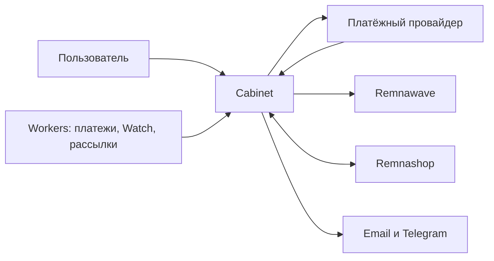

<div align="center">

# Remnawave Cabinet

**Личный кабинет и админка для VPN-сервиса на Remnawave.**

Email-first авторизация, оплата, выдача подписки, поддержка, бонусы, рефералы и контроль инфраструктуры в одном интерфейсе.

[Быстрый запуск](#быстрый-запуск) · [Развёртывание](./DEPLOYMENT.md) · [Runbook сервера](./deploy/RUNBOOK.md) · [Конфигурация](./deploy/env.production.example)

[](https://github.com/asdcrosh/cabinet_remna/actions/workflows/quality.yml)
[](https://github.com/asdcrosh/cabinet_remna/actions/workflows/docker-image.yml)

</div>

> [!IMPORTANT]
> Production устанавливается из Docker-образа. На сервере не нужен клон репозитория: установщик создаёт `/opt/remnawave-cabinet`, `.env` и compose-конфигурацию сам.

## Что внутри

| Пользователю | Администратору | Инфраструктуре |
| --- | --- | --- |
| Регистрация по email, вход через Telegram Mini App и Яндекс ID | Тарифы, промокоды, платежи, пользователи, поддержка и аудит | Docker-установка, health-check, workers, бэкапы и Watch |
| Покупка и продление подписки через YooKassa, PayAnyWay или Platega | Рефералы, кампании, персональные офферы и бонусный бокс | Remnawave и Remnashop: синхронизация и диагностика |
| QR-код, ссылка подписки, трафик, устройства и история покупок | Рассылки, уведомления, роли и состояние системы | Caddy или внешний Nginx, Sentry, retention cleanup |



## Быстрый запуск

### Production

Подходит для чистого Ubuntu/Debian-сервера или сервера, где уже работают Remnawave и Remnashop.

1. Создайте `A`-запись домена кабинета на IP сервера.
2. Установите только управляющую консоль:

```bash
installer="$(mktemp)"
curl -fsSL --proto '=https' --tlsv1.2 \
  https://raw.githubusercontent.com/asdcrosh/cabinet_remna/main/deploy/install-console.sh \
  -o "${installer}"
bash -n "${installer}"
sudo bash "${installer}"
rm -f "${installer}"
```

После этой команды установлен только `/usr/local/bin/cabinetctl`. Docker,
Remnawave, Remnashop, Cabinet, контейнеры и модуль бэкапов не устанавливаются.

3. Выберите нужный сценарий:

Новая установка Cabinet:

```bash
sudo cabinetctl install
```

Перенос существующей установки из полного бэкапа:

```bash
sudo cabinetctl backups
```

Во втором случае не запускайте `cabinetctl install`. Команда `cabinetctl backups`
сама установит Docker и модуль бэкапов, после чего откроет меню настройки S3 и
восстановления локального или удалённого архива.

4. При новой установке ответьте на вопросы мастера: домен, Remnawave, email и
   платёжный провайдер, затем создайте первого администратора.
5. После установки или восстановления проверьте запуск:

```bash
cabinetctl health
cabinetctl url
```

После установки откройте кабинет и в админке последовательно настройте: тарифы, способы оплаты, почту, поддержку и, при необходимости, интеграцию Remnashop.

<details>
<summary>Если на 80/443 уже работает Nginx или Remnawave</summary>

Установщик не должен занимать чужие порты. Для автоматического подключения кабинета к nginx рядом с Remnawave используйте:

```bash
sudo cabinetctl nginx
```

Подробности и безопасный откат: [deploy/RUNBOOK.md](./deploy/RUNBOOK.md#5-existing-remnawave-nginx).
</details>

### Локальная разработка

Требуются Node.js **20.9+**, Docker и Docker Compose.

```bash
git clone https://github.com/asdcrosh/cabinet_remna.git
cd cabinet_remna
npm install
cp .env.example .env
docker compose -f docker-compose.local.yml up -d
npm run prisma:deploy
npm run db:seed
npm run dev
```

Откройте [http://localhost:3000](http://localhost:3000).

Для изменения Prisma-схемы в разработке используйте `npm run prisma:migrate`; для просмотра данных — `npm run prisma:studio`.

## Первый рабочий контур

| Шаг | Где настроить | Результат |
| --- | --- | --- |
| 1. Подключить Remnawave | `.env` или мастер установки | Кабинет выдаёт и читает VPN-подписки |
| 2. Настроить email | `.env` | Регистрация, подтверждение и восстановление пароля |
| 3. Добавить способ оплаты | Админка → Система → Платёжные системы | Пользователь может оплатить тариф |
| 4. Создать тарифы | Админка → Тарифы | Каталог появляется в личном кабинете |
| 5. Провести тестовую оплату | Личный кабинет | Проверяется полный путь от оплаты до подписки |

> [!TIP]
> Для тарифа порядок отображения задаётся перетаскиванием в админке. Повторная синхронизация с Remnashop не меняет вручную сохранённый порядок.

## Интеграции

| Интеграция | Что даёт | Где смотреть |
| --- | --- | --- |
| **Remnawave** | Выдача, продление, отзыв подписки, трафик, устройства и QR-код | `REMNAWAVE_BASE_URL`, `REMNAWAVE_TOKEN` |
| **Remnashop** | Общие пользователи, каталог, оплаты, промокоды и двусторонняя синхронизация | `REMNASHOP_*`, Админка → Интеграции → Remnashop |
| **YooKassa** | Оплата, отмена и возврат с выдачей или отзывом доступа | Админка → Платёжные системы, `/api/webhook/yookassa` |
| **PayAnyWay** | Второй платёжный способ с подписанным callback | `/api/webhook/payanyway` |
| **Platega** | Альтернативный платёжный метод | `/api/webhook/platega` |
| **Resend или свой webhook** | Письма подтверждения и восстановления | `EMAIL_VERIFICATION_WEBHOOK_*` |
| **Telegram** | Mini App, вход, owner-only уведомления об оплатах и поддержке, бэкапы | `TELEGRAM_BOT_TOKEN`, `TELEGRAM_NOTIFY_CHAT_ID`, `ADMIN_TELEGRAM_CHAT_ID` |
| **Watch** | Проверка Panel API, нод, XHTTP/TCP Reality и уведомления об инцидентах | Админка → Watch, `WATCH_*` |

### Remnashop: ожидаемая схема работы

Remnashop и Cabinet не подменяют друг друга:

- **Cabinet** отвечает за интерфейс, платежи, промо, бонусы и поддержку.
- **Remnashop** остаётся источником совместимых данных магазина и технической учётной записи.
- **Remnawave** хранит фактически выданную VPN-подписку.

На одном сервере установщик находит `remnashop-db`, подключает контейнеры к общей сети и заполняет необходимые `REMNASHOP_*` значения. Для отдельного сервера используйте инструкцию [в runbook](./deploy/RUNBOOK.md#7-remnashop-database). Периодическая синхронизация работает как резерв; для мгновенных обновлений Remnashop отправляет события на `/api/integrations/remnashop/events`.

## Конфигурация

Единственный production-файл:

```text
/opt/remnawave-cabinet/.env
```

Открыть его безопаснее через:

```bash
cabinetctl env
cabinetctl config-check
```

Установщик генерирует локальные секреты. Для первого запуска нужны реальные значения домена, Remnawave, почты и хотя бы одного платёжного провайдера. Полный, актуальный и комментированный список переменных находится в [deploy/env.production.example](./deploy/env.production.example).

Минимальный контур выглядит так:

```env
CABINET_DOMAIN="cabinet.example.com"
APP_URL="https://cabinet.example.com"
ALLOWED_ORIGINS="https://cabinet.example.com"
REMNAWAVE_BASE_URL="https://panel.example.com"
REMNAWAVE_TOKEN="..."
EMAIL_VERIFICATION_WEBHOOK_URL="https://cabinet.example.com/api/email/resend"
EMAIL_VERIFICATION_WEBHOOK_SECRET="..."
RESEND_API_KEY="..."
EMAIL_FROM="VPN Service <noreply@example.com>"
```

Не коммитьте `.env`, токены, дампы баз и пользовательские загрузки.

## Сервисы в production

```text
db → check-env → migrate → seed → app + workers
```

| Сервис | Назначение |
| --- | --- |
| `app` | Next.js кабинет и API |
| `worker` | Сверка платежей, выдача подписок и синхронизация Remnashop |
| `broadcast-worker` | Очередь рассылок |
| `watch-worker` | Мониторинг нод и Reality-кромок |
| `node-provisioning-worker` | Создание нод через Timeweb, включается профилем `provisioning` |
| `retention-cleanup` | Очистка старых журналов, включается профилем `maintenance` |
| `caddy` | Встроенный HTTPS reverse proxy, включается профилем `caddy` |

Посмотреть реальное состояние:

```bash
cabinetctl status
cabinetctl ps
cabinetctl logs app
```

## Эксплуатация

### Основные команды `cabinetctl`

| Команда | Действие |
| --- | --- |
| `cabinetctl update` | Скачать свежий образ, применить миграции и перезапустить сервисы |
| `cabinetctl deploy-status` | Показать результат последнего обновления и health-check |
| `cabinetctl restart` | Перезапустить приложение и workers без обновления |
| `cabinetctl health` | Проверить доступность системы |
| `cabinetctl logs [service]` | Открыть логи сервиса |
| `cabinetctl nginx` | Настроить Nginx и HTTPS рядом с Remnawave |
| `cabinetctl provisioning` | Настроить создание нод через Timeweb |
| `cabinetctl backups` | Создание, восстановление и S3-бэкапы |
| `cabinetctl backup-schedule` | Расписание автоматического бэкапа и отправки в S3 |
| `cabinetctl backup-status` | Последний запуск и состояние расписания |
| `cabinetctl backup-notify-test` | Проверить Telegram-уведомление о бэкапе |

### Обновление

```bash
cabinetctl update
```

Обновление сохраняет `.env`, Docker volume базы и администратора. После успешного health-check оно может отправить одно уведомление в Telegram, если заданы `TELEGRAM_BOT_TOKEN` и корректный `TELEGRAM_NOTIFY_CHAT_ID`.

Уведомления об успешных покупках, задержке выдачи подписки и новых сообщениях поддержки отправляются только владельцу. Получатель задаётся через `ADMIN_TELEGRAM_CHAT_ID`; если он пуст, используется `TELEGRAM_NOTIFY_CHAT_ID`. Для отключения установите `ADMIN_TELEGRAM_NOTIFICATIONS_ENABLED=false`. Очередь хранится в базе, защищена от дублей и повторяет временно неудачные отправки. Проверка на сервере без создания платежа или обращения:

```bash
docker exec remnawave-cabinet-worker node ops/admin-telegram-test.js
```

### Бэкапы и перенос

Полный архив включает Remnawave, Remnashop и Cabinet: конфигурации, `.env` и PostgreSQL-дампы.

```bash
cabinetctl backups
cabinetctl backup-schedule
```

Расписание использует persistent systemd timer: пропущенный из-за перезагрузки запуск выполнится после старта сервера. Успех и ошибка отправляются в Telegram. Для восстановления на новом сервере сначала установите только `cabinetctl`:

```bash
installer="$(mktemp)"
curl -fsSL --proto '=https' --tlsv1.2 \
  https://raw.githubusercontent.com/asdcrosh/cabinet_remna/main/deploy/install-console.sh \
  -o "${installer}"
bash -n "${installer}"
sudo bash "${installer}"
rm -f "${installer}"
```

Затем отдельно откройте восстановление:

```bash
sudo cabinetctl backups
```

При переносе всего стека не устанавливайте Remnawave, Remnashop или Cabinet отдельно до восстановления. На новом сервере:

1. установите только `cabinetctl` командой выше;
2. откройте `cabinetctl backups`;
3. для удалённого архива сначала настройте S3, для локального — скопируйте его в `/opt/remnawave-backups`;
4. запустите восстановление и после него проверьте DNS, firewall и адреса нод Remnawave.

> [!WARNING]
> Не используйте `docker volume rm`, `docker compose down -v` или `git reset --hard` на production-сервере без проверенного бэкапа.

## Разработка и качество

| Команда | Назначение |
| --- | --- |
| `npm run validate` | ESLint, TypeScript, env-check и тесты |
| `npm run build` | Prisma generate и production-сборка |
| `npm run test` | Все Vitest-тесты |
| `npm run test:e2e` | Playwright E2E-проверки с тестовой БД |
| `npm run test:smoke` | Smoke-проверка собранного приложения |
| `npm run worker:payments` | Локальный worker платежей |
| `npm run worker:watch` | Локальный Watch worker |
| `npm run worker:broadcasts` | Локальный worker рассылок |

CI для pull request проверяет Prisma, миграции, зависимости, линтер, типы, покрытие тестами, production build и Playwright. Push в `main` публикует Docker-образы в GHCR:

```text
ghcr.io/asdcrosh/cabinet_remna:latest
ghcr.io/asdcrosh/cabinet_remna-provisioner:latest
```

### Структура репозитория

```text
src/app/           страницы и API routes Next.js
src/components/    интерфейс кабинета, админки и общие UI-компоненты
src/lib/           бизнес-логика, интеграции, авторизация и тесты
prisma/            схема, миграции и seed
scripts/           workers, smoke-check и служебные задачи
deploy/            compose, установщик, бэкапы и runbook
.github/workflows/ CI и публикация образов
```

## Документация

| Документ | Когда открыть |
| --- | --- |
| [DEPLOYMENT.md](./DEPLOYMENT.md) | Нужны детали image-based deploy, GHCR и reverse proxy |
| [deploy/RUNBOOK.md](./deploy/RUNBOOK.md) | Нужна пошаговая установка, Remnashop или диагностика сервера |
| [deploy/env.production.example](./deploy/env.production.example) | Нужно заполнить или проверить `.env` |
| [deploy/152-fz-checklist.md](./deploy/152-fz-checklist.md) | Подготовка юридической части и 152-ФЗ |
| [AGENTS.md](./AGENTS.md) | Правила разработки в репозитории |
