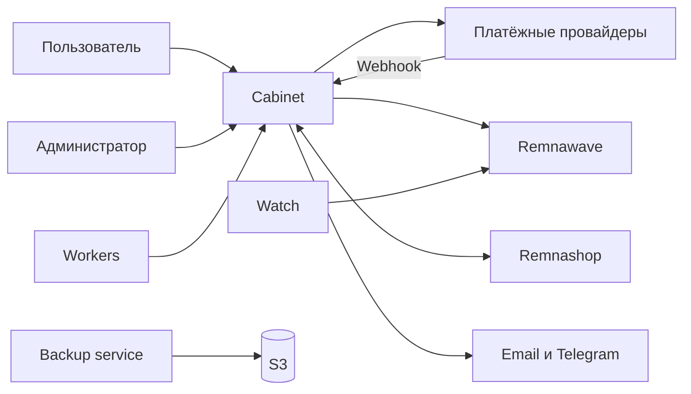

<p align="center">
  
</p>

<h1 align="center">Remnawave Cabinet</h1>

<p align="center">
  <strong>Личный кабинет и центр управления VPN-сервисом на Remnawave.</strong>
  <br />
  От регистрации и оплаты до выдачи подписки, поддержки и мониторинга нод.
</p>

<p align="center">
  <a href="https://github.com/asdcrosh/cabinet_remna/actions/workflows/quality.yml"></a>
  <a href="https://github.com/asdcrosh/cabinet_remna/actions/workflows/docker-image.yml"></a>
  
  
  
</p>

<p align="center">
  <a href="#быстрый-запуск"><strong>Быстрый запуск</strong></a>
  ·
  <a href="./DEPLOYMENT.md">Развёртывание</a>
  ·
  <a href="./deploy/RUNBOOK.md">Runbook</a>
  ·
  <a href="./deploy/env.production.example">Переменные окружения</a>
</p>

<p align="center">
  
</p>

> [!IMPORTANT]
> Production работает из готового Docker-образа. Клонировать репозиторий на сервер не нужно: `cabinetctl` создаёт каталог, конфигурацию и сервисы самостоятельно.

## Один кабинет вместо набора разрозненных инструментов

<table>
  <tr>
    <td width="33%" valign="top">
      <strong>Для пользователя</strong><br /><br />
      Понятная покупка тарифа, подключение через INCY, управление устройствами, поддержка, бонусы и история операций.
    </td>
    <td width="33%" valign="top">
      <strong>Для администратора</strong><br /><br />
      Пользователи, тарифы, платежи, промокоды, рассылки, рефералы, бонусы, аудит и диагностика в одном интерфейсе.
    </td>
    <td width="33%" valign="top">
      <strong>Для инфраструктуры</strong><br /><br />
      Workers, Watch, health-check, бэкапы, S3, создание нод и синхронизация с Remnawave и Remnashop.
    </td>
  </tr>
</table>

```text
Регистрация → Оплата → Выдача подписки → Подключение в INCY → Контроль и продление
```

## Быстрый запуск

### Production

Подходит для чистого Ubuntu/Debian-сервера и для сервера, где уже работают Remnawave или Remnashop.

**1.** Направьте `A`-запись домена кабинета на IP сервера.

**2.** Установите управляющую консоль:

```bash
installer="$(mktemp)"
curl -fsSL --proto '=https' --tlsv1.2 \
  https://raw.githubusercontent.com/asdcrosh/cabinet_remna/main/deploy/install-console.sh \
  -o "${installer}"
bash -n "${installer}"
sudo bash "${installer}"
rm -f "${installer}"
```

Эта команда устанавливает только `/usr/local/bin/cabinetctl`. Приложение и контейнеры появятся после выбора сценария.

**3.** Запустите новую установку:

```bash
sudo cabinetctl install
```

**4.** Проверьте результат:

```bash
cabinetctl health
cabinetctl url
```

Готово. Далее в админке настройте тарифы, способ оплаты, почту и поддержку.

<details>
<summary><strong>На сервере уже заняты порты 80 и 443</strong></summary>

Подключите Cabinet к существующему Nginx рядом с Remnawave:

```bash
sudo cabinetctl nginx
```

Безопасный сценарий и откат описаны в [server runbook](./deploy/RUNBOOK.md#5-existing-remnawave-nginx).
</details>

<details>
<summary><strong>Нужно восстановиться из локального или S3-бэкапа</strong></summary>

После установки `cabinetctl` не запускайте обычную установку. Сразу откройте менеджер бэкапов:

```bash
sudo cabinetctl backups
```

Он установит необходимые компоненты, подключит S3 и проведёт восстановление полного стека.
</details>

### Локальная разработка

Нужны Node.js **20.9+**, Docker и Docker Compose.

```bash
git clone https://github.com/asdcrosh/cabinet_remna.git
cd cabinet_remna
npm install
cp .env.example .env
docker compose -f docker-compose.local.yml up -d
npm run prisma:deploy
npm run db:seed
npm run dev
```

Откройте [localhost:3000](http://localhost:3000).

## Возможности

| Контур | Что реализовано |
| --- | --- |
| **Доступ** | Email-first регистрация, подтверждение почты, восстановление пароля, Telegram Mini App и Яндекс ID |
| **Подписка** | Покупка, продление, отзыв доступа, трафик, устройства, QR-код и подключение через INCY |
| **Платежи** | YooKassa, PayAnyWay и Platega, webhooks, возвраты, сверка и идемпотентная выдача |
| **Продажи** | Тарифы с ручной сортировкой, промокоды, персональные предложения, кампании и реферальная программа |
| **Бонусы** | Приветственный бонус, задания, колесо подарков, призы, история и антифрод |
| **Коммуникации** | Поддержка, уведомления, Telegram и сегментированные рассылки |
| **Управление** | Пользователи, роли, платежи, аудит, восстановление данных и единый экран состояния системы |
| **Инфраструктура** | Watch, workers, provisioning нод, health-check, retention cleanup, локальные и S3-бэкапы |

## Архитектура



### Границы ответственности

- **Cabinet** управляет интерфейсом, платежами, бонусами, поддержкой и бизнес-логикой.
- **Remnawave** хранит фактически выданные VPN-подписки и состояние нод.
- **Remnashop** остаётся совместимым источником пользователей и данных магазина, если интеграция включена.
- **Workers** выполняют сверку платежей, синхронизацию, рассылки, Watch и служебные задачи вне HTTP-запроса.

## Интеграции

| Сервис | Назначение | Настройка |
| --- | --- | --- |
| **Remnawave** | Выдача, продление и отзыв подписки, трафик и устройства | `REMNAWAVE_BASE_URL`, `REMNAWAVE_TOKEN` |
| **Remnashop** | Пользователи, каталог, оплаты, промокоды и двусторонняя синхронизация | `REMNASHOP_*` и раздел интеграции в админке |
| **YooKassa** | Оплата, отмена и возврат | Платёжные системы и `/api/webhook/yookassa` |
| **PayAnyWay** | Альтернативная оплата с подписанным callback | Платёжные системы и `/api/webhook/payanyway` |
| **Platega** | Дополнительный платёжный метод | Платёжные системы и `/api/webhook/platega` |
| **Resend** | Подтверждение email и восстановление пароля | `RESEND_API_KEY`, `EMAIL_FROM` |
| **Telegram** | Mini App и служебные уведомления владельцу | `TELEGRAM_BOT_TOKEN`, `ADMIN_TELEGRAM_CHAT_ID` |
| **Sentry** | Ошибки приложения и workers | `SENTRY_*` |
| **S3** | Удалённое хранение полных бэкапов | `cabinetctl backups` |

<details>
<summary><strong>Как работает связка с Remnashop</strong></summary>

На одном сервере установщик находит `remnashop-db`, подключает контейнеры к общей сети и заполняет необходимые `REMNASHOP_*` значения. Для раздельных серверов используйте [инструкцию по внешней базе](./deploy/RUNBOOK.md#7-remnashop-database).

Периодическая синхронизация страхует интеграцию, а мгновенные изменения приходят через `/api/integrations/remnashop/events`.
</details>

## Первый рабочий контур

| Шаг | Действие | Готовый результат |
| ---: | --- | --- |
| **01** | Подключить Remnawave | Cabinet читает и выдаёт VPN-подписки |
| **02** | Настроить email | Работают регистрация и восстановление доступа |
| **03** | Добавить платёжный провайдер | Можно создать реальную оплату |
| **04** | Создать и отсортировать тарифы | Каталог доступен пользователю |
| **05** | Провести тестовую покупку | Проверен путь от платежа до подключения в INCY |

> [!TIP]
> Порядок тарифов задаётся перетаскиванием в админке и не сбрасывается после синхронизации с Remnashop.

## Управление сервером

Все повседневные операции собраны в `cabinetctl`.

| Команда | Что делает |
| --- | --- |
| `cabinetctl status` | Показывает состояние установки |
| `cabinetctl health` | Проверяет приложение и зависимости |
| `cabinetctl update` | Обновляет образы, применяет миграции и проверяет запуск |
| `cabinetctl deploy-status` | Показывает результат последнего обновления |
| `cabinetctl restart` | Перезапускает приложение и workers |
| `cabinetctl logs app` | Открывает логи нужного сервиса |
| `cabinetctl nginx` | Настраивает Nginx и HTTPS рядом с Remnawave |
| `cabinetctl provisioning` | Настраивает автоматическое создание нод |
| `cabinetctl backups` | Управляет локальными и S3-бэкапами |
| `cabinetctl backup-schedule` | Настраивает расписание бэкапов |

<details>
<summary><strong>Какие контейнеры запускаются</strong></summary>

| Сервис | Назначение |
| --- | --- |
| `app` | Next.js интерфейс и API |
| `db` | PostgreSQL |
| `worker` | Платежи, подписки и синхронизация Remnashop |
| `broadcast-worker` | Очередь рассылок |
| `watch-worker` | Мониторинг нод и Reality-кромок |
| `node-provisioning-worker` | Создание нод через Timeweb |
| `retention-cleanup` | Очистка старых журналов |
| `caddy` | Встроенный HTTPS reverse proxy, если выбран этот профиль |
</details>

## Конфигурация

Production использует один файл:

```text
/opt/remnawave-cabinet/.env
```

Открывайте и проверяйте его через консоль:

```bash
cabinetctl env
cabinetctl config-check
```

Актуальный список переменных с комментариями находится в [`deploy/env.production.example`](./deploy/env.production.example).

> [!CAUTION]
> Не коммитьте `.env`, токены, дампы баз и пользовательские загрузки. Не запускайте `docker compose down -v`, `docker volume rm` или `git reset --hard` на production без проверенного бэкапа.

## Разработка и качество

```bash
npm run validate       # lint + typecheck + env-check + tests
npm run build          # Prisma generate + production build
npm run test:e2e       # Playwright с тестовой БД
npm run test:smoke     # smoke-check собранного приложения
```

CI проверяет миграции Prisma, зависимости, линтер, типы, тесты, production build и Playwright. Push в `main` публикует:

```text
ghcr.io/asdcrosh/cabinet_remna:latest
ghcr.io/asdcrosh/cabinet_remna-provisioner:latest
```

### Структура репозитория

```text
src/app/             страницы и API routes
src/components/      интерфейс и общие UI-компоненты
src/lib/             бизнес-логика, интеграции и тесты
prisma/              схема, миграции и seed
scripts/             workers и служебные задачи
deploy/              установка, compose, бэкапы и runbook
.github/workflows/   CI и публикация образов
```

## Документация

| Документ | Когда нужен |
| --- | --- |
| [Deployment](./DEPLOYMENT.md) | Image-based deploy, GHCR и reverse proxy |
| [Server runbook](./deploy/RUNBOOK.md) | Установка, перенос, Remnashop и диагностика |
| [Production env](./deploy/env.production.example) | Настройка и проверка `.env` |
| [152-ФЗ checklist](./deploy/152-fz-checklist.md) | Юридическая и организационная подготовка |
| [Repository guidelines](./AGENTS.md) | Правила разработки в проекте |

<p align="center">
  <strong>Remnawave Cabinet</strong><br />
  Один понятный интерфейс для пользователя, администратора и инфраструктуры.
</p>
